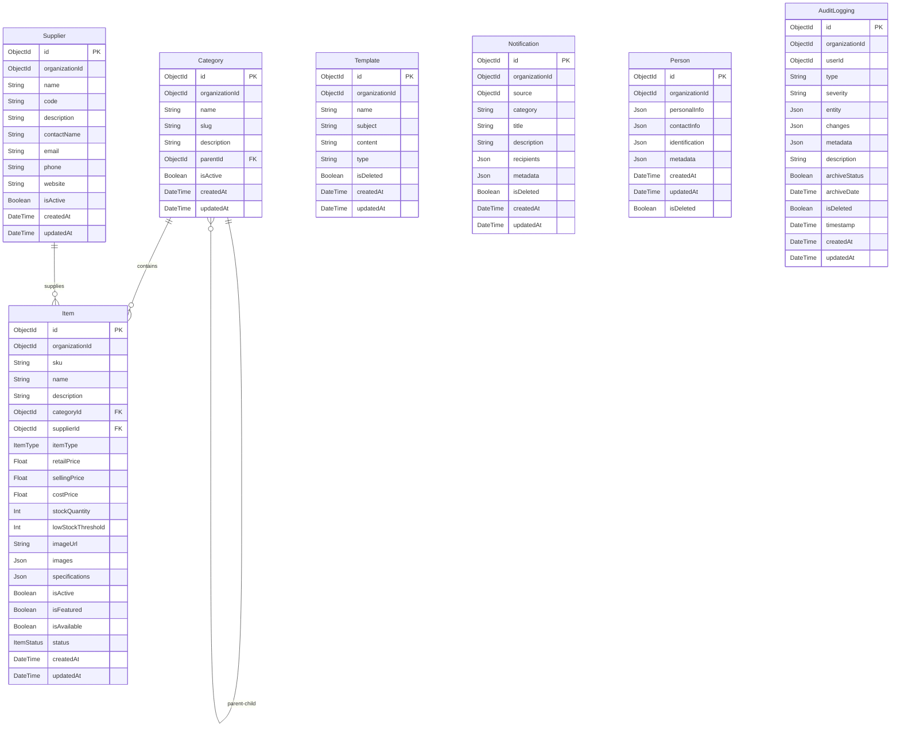

# Database Schema Diagram (SCM API)

This Mermaid diagram represents the **current** database schema for the `scm-api` service.

---

## Key Relationships Summary

### Product Catalog

- **Category** → **Category** (Self-referential): hierarchical category structure
- **Category** → **Item** (One-to-Many): categories contain items
- **Supplier** → **Item** (One-to-Many): suppliers supply items
